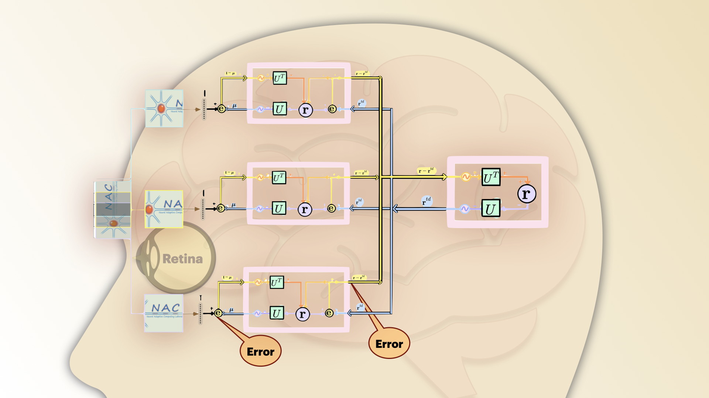

# RGC to PC

## Retina

## Clues 

### Orientation Selective Responde
Simple cells in Hubble and Wiesel Experiment 1962
### End-stopped
Extra-classical receptive fields (Contextual Modulation and Surround Suppression) effects clue that the brain is using efficient coding (redundancy reduction).
     
To investigate whether some of these effects could 
result from the extended positive correlations along 
dominant orientation directions in natural images, 

I personally, found reading old papers challenging with lack of required backgrounds. On the other hand working at the computer science field, some of the stuffs looks very obvious since we grow with them, and understanding what has been established before the predictive coding and the way it is a very important framework seems unclear; or at least to me. Here I decided to teach the predictive coding to me, who couldn't find the glory at first but got fascinated when they went into. I hope you enjoy reading my tutorial for the predictive coding (historical attempts to get there since 1962 to 1999).
