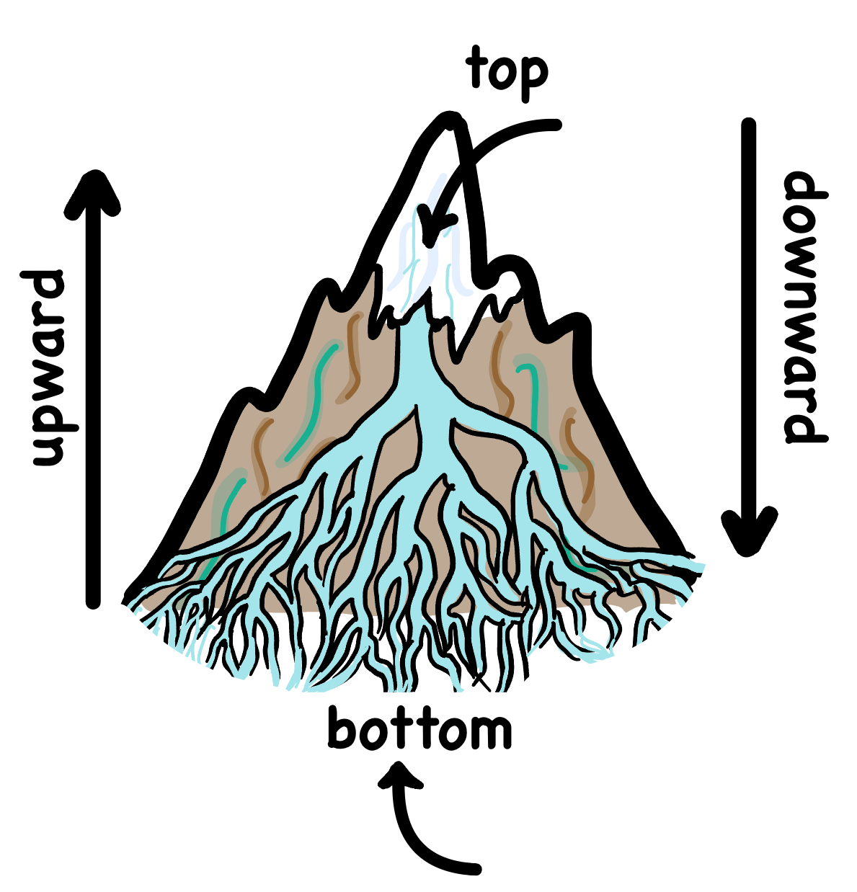
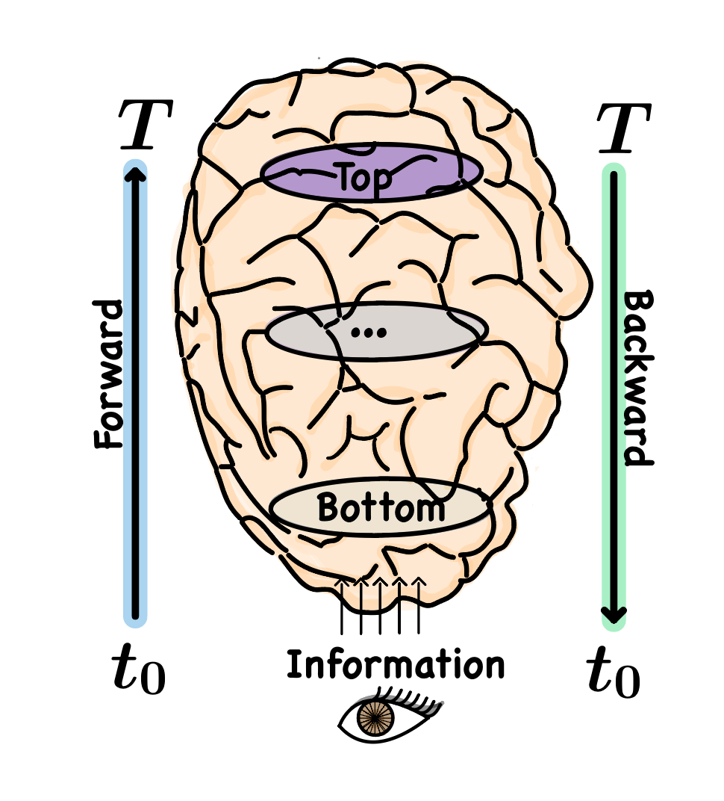

<h1> Information Flow </h1>
  
  
  
  <h3>Spatial dimension</h3>
  
  The information flow and its pathway, is determined by their starting point 
  (either **bottom** or **top**) and the direction they follows (either **up** or **down**):
  * **Top-down**: When the information source is at the **top** and it goes **downward**.
  * **Bottom-up**: When the information source is at the **bottom** and it goes **upward**. 

  <h3>Temporal dimension</h3>

  The information flow creates a stream (direction) where the information
  flows in time. Depending on the source of information, forward and backward 
  can be either top-down or bottom-up information pathway Considering the sequence of the
  information flow:
  * **Forward**: When the information goes forward in time; it is at the source and  
  goes away from the source. (moving with the flow)
  * **Backward**: When the information flows backward in time; it is at the descination
    and it backs down toward the source. in the opposite direction of forward. (moving against the flow)

  
 <h2> 
  Information Flow in the Brain
  </h2>

  

  In order to specify the brain processing in the unified way, the brain processing 
  is considered to be vertically; dividing the brain system into 
  the hierarchy to specify the source and direction of the information.
  In the visual hierarchy we consider the Retina (eye) as the most bottom level
  and as it goes up into the brain processing, the information goes higher level.

  * **Traditional Bottom-Up Model:** Considering the retina as the information source, traditionally
  it has been thought once observe by reflecting light from outside hits the retina and passes through
  there is a unidirectional information flow encoding stimuli and it upward to the higher levels in the
  brain for processing where learning happens. Therefore, retina is the earliest stage in visual processing
  and the information goes forward in time (later) thus information path is bottom-up and forward;
  while the information from the brain to the Retina is backward and top-down. This model is solely a
  bottom-up processing where there is a one-way flow.
 
    **Forward only pathway: Retina (RGC) → LGN → V1 → V2 → ... → V4 → IT**

  * **Predictive Coding Model**: Brain is considered as the source of information where the prediction of
    the stimuli is sourced (earliest), and the information goes forward in time, downward to the lower-level
    in the brain for (later) assessment, then the prediction path is forward top-down; while the information
    from retina to the higher level of the brain is backward (prediction error).
    In predictive coding, the prediction is sourced at the higher level of the brain going downward
    (prediction signal path is top-down and forward in time (earlier));
    while the prediction error is sourced at the lower level going upward
    (error signal gows bottom-up and backward in time (later)).
    
    **Forward pathway: IT → V4 → ... → V1 → V2 → LGN**
    **Backward pathway: Retina (RGC) → LGN → V1 → V2 → ... → V4 → IT**
    

  

LGN = Lateral Geniculate Nucleus
RGC = Retina Ganglion Cell

  

  
