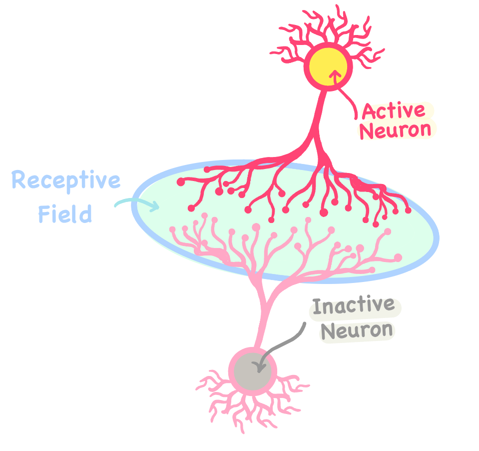
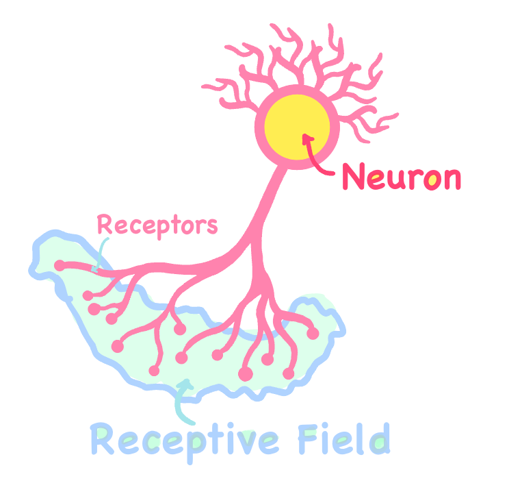
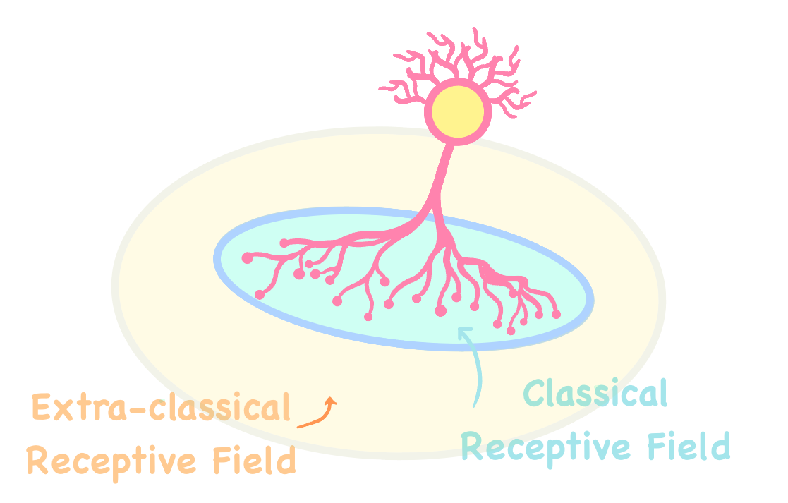
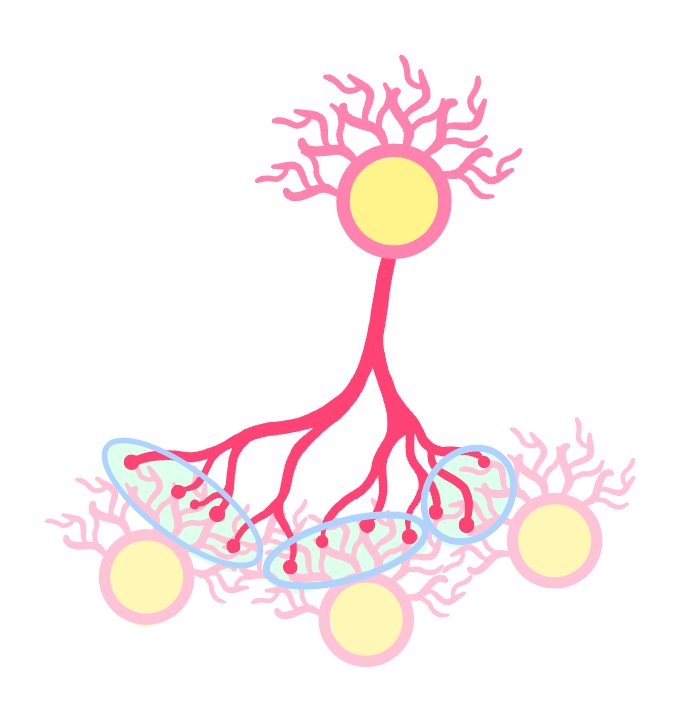

<h1> Neural Activation and Receptive Field </h1>

  

  

  In the brain, different neurons are specialized to respond to specific patterns of sensory inputs. 
  A neuron can be either active (excited) or inactive (inhibited) in response to a stimulus.

  **Active Neuron**: When a neuron positively responses to a stimulus and its activity is increased as a respond
  to an input stimulus, it shows excitatory response and we say “the stimulus excites neuron”.
  
  **Inactive Neuron**: When a neuron activity is decreased (suppressed/inhibited) as a respond to an input stimulus, 
  it shows inhibitory response and we say “the stimulus inhibits neuron”.

-----------------------------------------------------------------------------------------------------------

<h2>Receptive Field</h2>

  

Receptive field is the property of a neuron that is used to represent a sensory pattern or stimulation that is 
expected to stimulate the neuron (increase or decrease the neuron's respond), directly or indirectly. [^longnote]. 
In order for brain to process complex patterns, neurons have different types of receptive fields according to their effect on the neuron.

* **Classical RF**: The region where the neuron directly responds to the stimulus, positively or negatively, is called Classical Receptive Field (CRF).
- **Orientation Tuned Neurons:** Neurons that are precisely tuned to respond directly to stimuli  in their classical receptive field with specific orientations.
- **Length Tuned Neurons:** Specific neurons are precisely tuned to respond directly to particular stimulus lengths in their classical receptive field.

* **Extra-classical RF (Non-classical RF)**: The region outside of the neuron's classical receptive field if can cause neuron to respond indirectly to the stimulus, positively or negatively, is called Cxtra-classical Receptive Field (ECRF) or non-classical RF.

  [^longnote]: In the hierarchy, the receptive field of neurons spans to extended field as a 
  higher-level neuron responds to a collection of neural responses at the level 
  below which collectively forms the receptive field of that neuron characterizing
  the stimuli pattern which is most likely to make the neuron fire [2]. 

-----------------------------------------------------------------------------------------------------------

  <h3>Classical Receptive Field (CRF)</h3>
  
  The primary area within the neuron's receptive field where stimulation can 
  directly effects the neuron's response; can either excite or inhibit the neuron.

  <h4> Retinal Center-surround Receptive Fields </h4>
  
  * **On-center/Off-surround cells**: The cells which respond is maximum to stimulus with bright center
    and dark surrounds. These cells respond gets suppressed (stop responding) if the stimulus has otherwise patter (dark center
    with bright around)
    
  * **Off-center/On-surround cells**: The cells which respond is maximum to stimulus with dark center
    and bright surrounds. These cells respond gets suppressed (stop responding) if the stimulus has otherwise
    patter (bright center with dark around)

-----------------------------------------------------------------------------------------------------------

  <h3> Extra-Classical Receptive Field (ECRF) </h3>

  

   Extra-classical receptive field of a neuron (or non-classical receptive field)
   is the complementary area within the neuron's receptive field that is not intersecting
   with its classical receptive field. In other words, the part of a neuron's receptive field 
   which cannot directly effect the neuron to response, but rather it indirectly can
   influence it is called the extra-classical receptive field of the neuron. 
   
   Existance of stimuli in the extra-classical receptive fields of a neuron cannot by 
   itself make a directly impact on the neuron's activation; but instead can effect 
   on the neuron's response indirectly through modulating the neuron's respond to the 
   same stimuli in its classical receptive field. 
   
   The prior assumption is that the same stimuli in ECRF also repeats in the CRF 
   because in natural image (what our brain is trained on) scenes have conceptual 
   correlation meaning that usually the same pattern is continuous in small areas 
   (patches) in an observation; and the same pattern spans both classical receptive 
   fields and extra classical receptive fields of a neuron. If the assumption turns
   out to be true the ECRF can modulate the neuron's response to its CRF, while if 
   the input stimulus within the CRF deviates from what the stimulus context in 
   ECRF, the prediction has a larger error and the neuron responds vigorously.

   This prediction of neurons response made based on the prior assumption (generalizatin
   of the stimuli to CRF) can have several effects on the neuron's activity. Depending on 
   the type of deviation, the extra-classical receptive field effect can be grouped as below:

    > "A vigorous response to an stimuli within the neuron's classical receptive field 
    that was most likely to activate the neuron is reduced or eliminated when the same 
    stimulus extends beyond the neuron’s classical receptive field (RF)"
    > [Rao & Ballard, 1999]
     
  **Contextual Modulation:** A neural mechanism by which the stimuli context in the surrounding regions of 
  classical RF can influence neural responses indirectly which causes Surround Suppression.  

  **Surround Suppression:** A phenomenon when contextual modulation have inhibitory effects and thus stimuli 
  in areas surrounding the classical receptive field reduce the neuron's response. 
  The case when the same conceptual/contextual stimuli as the extra-classical receptive field spans through 
  the classical receptive field as well, the neuron's responsece can  be predicted accurately by generalizing 
  the extra-classical receptive field stimuli. In the case that the stimuli in the classical receptive field 
  contexually differs from ones in extra-classical receptive field, the neuron's responsece cannot be predicted
  correctly and the concepualizing assumption goes wrong; and thus neurons stay active.
  
  End-stopping (End-inhibition) effect is an example for surround suppression and Length-Tuned End-stopping
  effect is a subcategory of scenarious where neurons shows end-stopping effects.

   **Length Tuned End-stopping Effect:** The neuron's response is suppressed when an
   optimally oriented bar (excitory stimuli for bar detecting neurons) extends beyond
   neuron's classical receptive fields. This indicates that neuron responds (activates)
   when the classical receptive fields carries information and do not responds to the
   information that is already predictable by the brain system. This indicates the brain
   is using efficient coding (redundancy reduction).

-----------------------------------------------------------------------------------------------------------

   * **Other Contextual Surround Effects**:

     > "When the stimulus properties in a neuron’s classical receptive field
     match the stimulus properties in the surrounding region (ECRF), little
     response is evoked from the the neuron while when the stimulus occurs
     in isolation, neuron eliciting a relatively large response.
     > [Rao & Ballard, 1999]
      
     
       **Orientation Tuned:**  
       **Orientation Contrast Grating:**  
       **Texture Effects:**  
       **Contextual Modulation:**  
      **Pop-out Texture:**  

     
--------------------------------------------------------------------------
Length Tuned End-stopping Effect  indicates the brain is using efficient coding (redundancy reduction).
     
  To investigate whether some of these effects could
  result from the extended positive correlations along dominant
  orientation directions in natural images, 

     
     > "When the stimulus properties in a neuron’s receptive field
     match the stimulus properties in the surrounding region, little
     response is evoked from the error-detecting neurons because the
    ‘surround’ can predict the ‘center.’ On the other hand, when the
     stimulus occurs in isolation, such a prediction fails, eliciting a
     relatively large response" [1,3].

  

  

